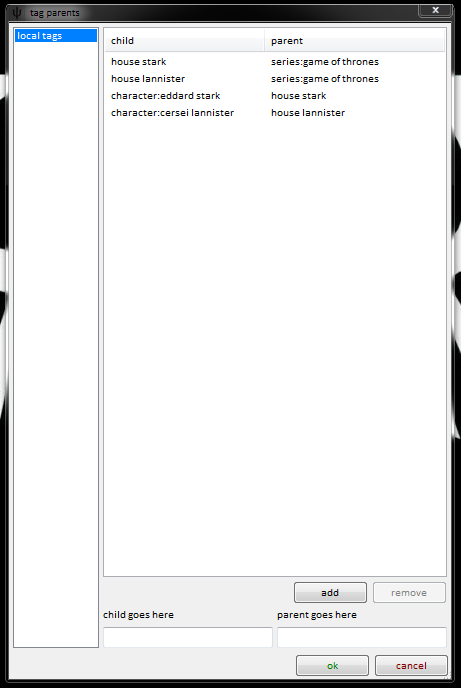
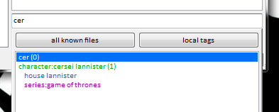
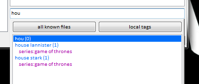

Tag parents let you automatically add a particular tag every time another tag is added. The relationship will also apply retroactively.

## what's the problem? { id="the_problem" }

Tags often fall into certain heirarchies. Certain tags _always_ imply certain other tags, and it is annoying and time-consuming to add them all individually every time.

For example, whenever you tag a file with _ak-47_, you probably also want to tag it _assault rifle_, and maybe even _firearm_ as well.

Another time, you might tag a file _character:eddard stark_, and then also have to type in _house stark_ and then _series:game of thrones_. (you might also think _series:game of thrones_ should actually be _series:a song of ice and fire_, but that is an issue for [siblings](advanced_siblings.md))

Drawing more relationships would make a significantly more complicated venn diagram, so let's draw a family tree instead:

```mermaid
graph TB
  got[series:game of thrones]
  got --- stark[house stark]
  got --- baratheon[house baratheon]
  got --- lannister[house lannister]
  got --- targaryen[house targaryen]
  stark --- eddard[character:eddard stark]
  stark ---- sansa[character:sansa stark]
  stark ----- bran[character:bran stark]
  baratheon --- robert[character:robert baratheon]
  lannister --- cersei[character:cersei lannister]
  lannister ---- jaime[character:jaime lannister]
  targaryen --- daenerys[character:daenerys targaryen]
```

e.g. cersei lannister is a member of house lannister, which occurs in the series game of thrones.

## tag parents { id="tag_parents" }

Let's define the child-parent relationship 'C->P' as saying that tag P is the semantic superset/superclass of tag C. **All files that have C should also have P, without exception.** When the user tries to add tag C to a file, tag P is added automatically.

Let's expand our weapon example:

```mermaid
graph TB
  firearm --- rifle
  firearm --- shotgun
  firearm --- handgun
  rifle --- assult[assult rifle]
  rifle --- semi[semi-automatic rifle]
  rifle --- bolt[bolt-action rifle]
  assult --- ak-47
  assult --- ak-74
  assult --- m16
  assult --- m4
  semi --- ar-15
  bolt --- winchester70[winchester model 70]
  shotgun ---- remington870[remington model 870]
  remington --- remington870
  handgun ---- m1911
  handgun ---- sw10[smith & wesson model 10]
  sw[smith and wesson] --- sw10
```

Searching for any term should generally return all the files tagged with anything below. Note that a tag can have more than one parent.

In that graph, adding _ar-15_ to a file would also add _semi-automatic rifle_, _rifle_, and _firearm_. Searching for _handgun_ would return everything with _m1911_ and _smith and wesson model 10_.

This can obviously get as complicated and autistic as you like, but be careful of being too confident--this is just a fun example, but is an AK-47 truly _always_ an assault rifle? Some people would say no, and beyond its own intellectual neatness, what is the purpose of attempting to create such a complicated and 'perfect' tree? Of course you can create any sort of parent tags on your local tags or your own tag repositories, but this sort of thing can easily lead to arguments between reasonable people. I only mean to say, as someone who does a lot of tag work, to try not to create anything 'perfect', as it usually ends up wasting time. Act from need, not toward purpose.

## how you do it { id="how_to_do_it" }

Go to _services->manage tag parents_:

Which looks and works just like the manage tag siblings dialog.

Note that when you hit ok, the client will look up all the files with all your added tag Cs and retroactively apply/pend the respective tag Ps if needed. This could mean thousands of tags!

Once you have some relationships added, the parents and grandparents will show indented anywhere you 'write' tags, such as the manage tags dialog:

Hitting enter on cersei will try to add _house lannister_ and _series:game of thrones_ as well.

## remote parents { id="remote_parents" }

Whenever you add or remove a tag parent pair to a tag repository, you will have to supply a reason (like when you petition a tag). A janitor will review this petition, and will approve or deny it. If it is approved, all users who synchronise with that tag repository will gain that parent pair. If it is denied, only you will see it.

## parent 'favourites' { id="parent_favourites" }

As you use the client, you will likely make several processing workflows to archive/delete your different sorts of imports. You don't always want to go through things randomly--you might want to do some big videos for a bit, or focus on a particular character. A common search page is something like `[system:inbox, creator:blah, limit:256]`, which will show a sample of a creator in your inbox, so you can process just that creator. This is easy to set up and save in your favourite searches and quick to run, so you can load it up, do some archive/delete, and then dismiss it without too much hassle.

But what happens if you want to search for multiple creators? You might be tempted to make a large OR search predicate, like `creator:aaa OR creator:bbb OR creator:ccc OR creator:ddd`, of all your favourite creators so you can process them together as a 'premium' group. But if you want to add or remove a creator from that long OR, it can be cumbersome. And OR searches can just run slow sometimes. One answer is to use the new tag parents tools to apply a 'favourite' parent on all the artists and then search for that favourite.

Let's assume you want to search bunch of 'creator' tags on the PTR. What you will do is:

*   Create a new 'local tag service' in _manage services_ called 'my parent favourites'. This will hold our subjective parents without uploading anything to the PTR.
*   Go to _tags->manage where tag siblings and parents apply_ and add 'my parent favourites' as the top priority for parents, leaving 'PTR' as second priority.
*   Under _tags->manage tag parents_, on your 'my parent favourites' service, add:
    
    *   `creator:aaa->favourite:aesthetic art`
    *   `creator:bbb->favourite:aesthetic art`
    *   `creator:ccc->favourite:aesthetic art`
    *   `creator:ddd->favourite:aesthetic art`
    
    Watch/wait a few seconds for the parents to apply across the PTR for those creator tags.
    
*   Then save a new favourite search of `[system:inbox, favourite:aesthetic art, limit:256]`. This search will deliver results with any of the child 'creator' tags, just like a big OR search, and real fast!

If you want to add or remove any creators to the 'aesthetic art' group, you can simply go back to _tags->manage tag parents_, and it will apply everywhere. You can create more umbrella/group tags if you like (and not just creators--think about clothing, or certain characters), and also use them in regular searches when you just want to browse some cool files.