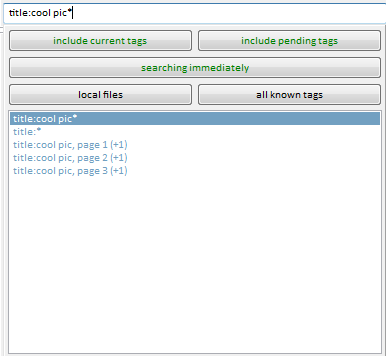
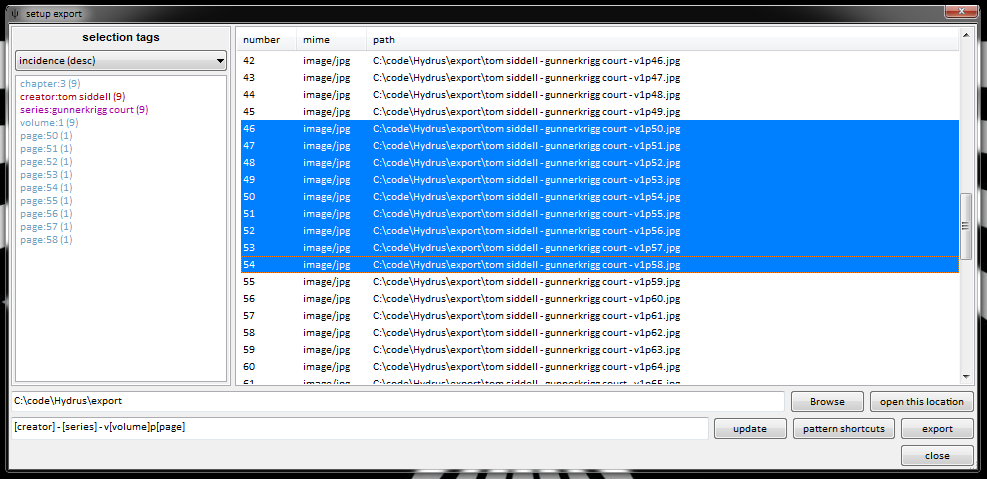

# more getting started with files

## searching with wildcards { id="wildcards" }

The autocomplete tag dropdown supports wildcard searching with `*`.

The `*` will match any number of characters. Every normal autocomplete search has a secret `*` on the end that you don't see, which is how full words get matched from you only typing in a few letters.

This is useful when you can only remember part of a word, or can't spell part of it. You can put `*` characters anywhere, but you should experiment to get used to the exact way these searches work. Some results can be surprising!

You can select the special predicate inserted at the top of your autocomplete results (the highlighted `*gelion` and `*va*ge*` above). **It will return all files that match that wildcard,** i.e. every file for every other tag in the dropdown list.

This is particularly useful if you have a number of files with commonly structured over-informationed tags, like this:

In this case, selecting the `title:cool pic*` predicate will return all three images in the same search, where you can conveniently give them some more-easily searched tags like `series:cool pic` and `page:1`, `page:2`, `page:3`.

## more searching

Let's look at the tag autocomplete dropdown again:

*   **favourite searches star**
    
    Once you get experience with the client, have a play with this. Rather than leaving common search pages open, save them in here and load them up as needed. You will keep your client lightweight and save time.
    
*   **include current/pending tags**
    
    Turn these on and off to control whether tag _search predicates_ apply to tags the exist, or limit just to those pending to be uploaded to a tag repository. Just searching 'pending' tags is useful if you want to scan what you have pending to go up to the PTR--just turn off 'current' tags and search `system:num tags > 0`.
    
*   **searching immediately**
    
    This controls whether a change to the search tags will instantly run the new search and get new results. Turning this off is helpful if you want to add, remove, or replace several heavy search terms in a row without getting UI lag.
    
*   **OR**
    
    You only see this if you have 'advanced mode' on. It is an experimental module. Have a play with it--it lets you enter some pretty complicated tags!
    
*   **file/tag domains**
    
    By default, you will search in 'my files' and 'all known tags' domain. This is the intersection of your local media files (on your hard disk) and the union of all known tag searches. If you search for `character:samus aran`, then you will get file results from your 'my files' domain that have `character:samus aran` in any tag service. For most purposes, this search domain is fine, but as you use the client more, you may want to access different search domains.
    
    For instance, if you change the file domain to 'trash', then you will instead get files that are in your trash. Setting the tag domain to 'my tags' will ignore other tag services (e.g. the PTR) for all tag search predicates, so a `system:num_tags` or a `character:samus aran` will only look 'my tags'.
    
    Turning on 'advanced mode' gives access to more search domains. Some of them are subtly complicated and only useful for clever jobs--most of the time, you still want 'my files' and 'all known tags'.
    

## sorting with system limit

If you add system:limit to a search, the client will consider what that page's file sort currently is. If it is simple enough--something like file size or import time--then it will sort your results before they come back and clip the limit according to that sort, getting the n 'largest file size' or 'newest imports' and so on. This can be a great way to set up a lightweight filtering page for 'the 256 biggest videos in my inbox'.

If you change the sort, hydrus will not refresh the search, it'll just re-sort the n files you have. Hit F5 to refresh the search with a new sort.

Not all sorts are supported. Anything complicated like tag sort will result in a random sample instead.

## exporting and uploading { id="intro" }

There are many ways to export files from the client:

*   **drag and drop**
    
    Just dragging from the thumbnail view will export (copy) all the selected files to wherever you drop them.
    
    The files will be named by their ugly hexadecimal [hash](faq.html#hashes), which is how they are stored inside the database.
    
    If you use this to open a file inside an image editing program, remember to go 'save as' and give it a new filename! The client does not expect files inside its db directory to change.
    
*   **export dialog**
    
    Right clicking some files and selecting _share->export->files_ will open this dialog:
    
    
    
    Which lets you export the selected files with custom filenames. It will initialise trying to export the files named by their hashes, but once you are comfortable with tags, you'll be able to generate much cleverer and prettier filenames.
    
*   **share->copy->files**
    
    This will copy the files themselves to your clipboard. You can then paste them wherever you like, just as with normal files. They will have their hashes for filenames.
    
    This is a very quick operation. It can also be triggered by hitting Ctrl+C.
    
*   **share->copy->hashes**
    
    This will copy the files' unique identifiers to your clipboard, in hexadecimal.
    
    You will not have to do this often. It is best when you want to identify a number of files to someone else without having to send them the actual files.
