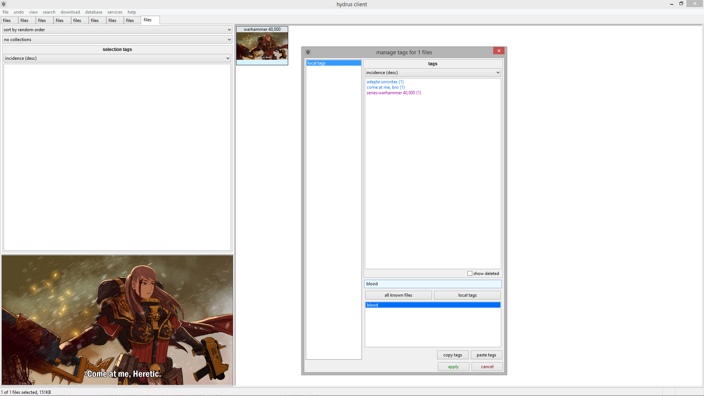
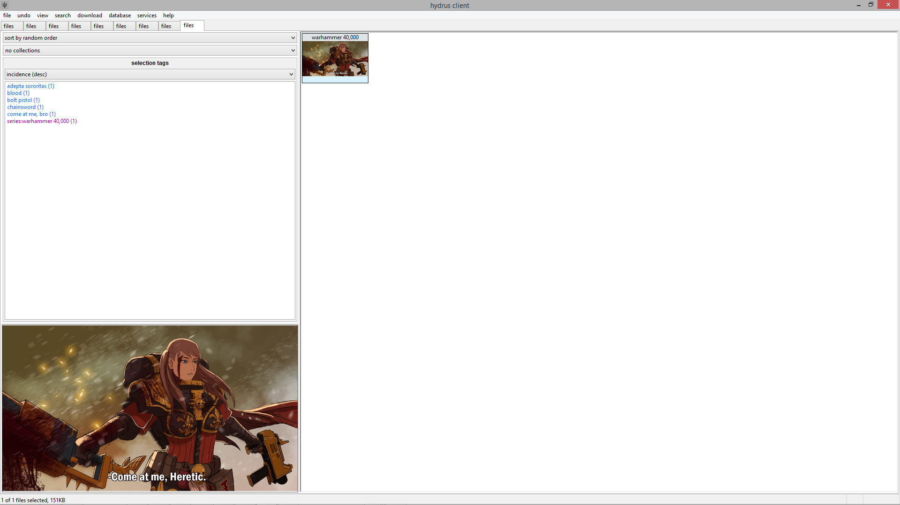
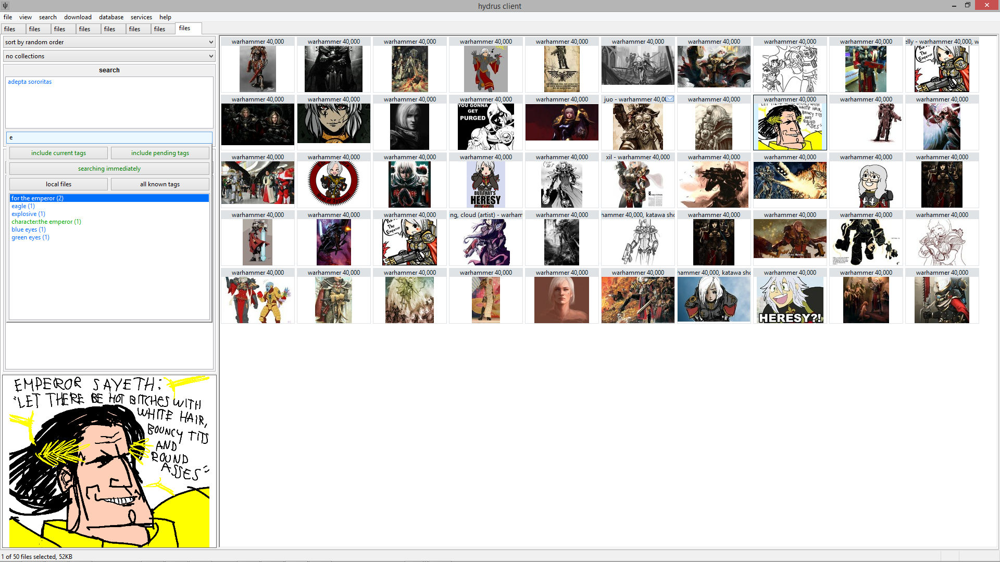
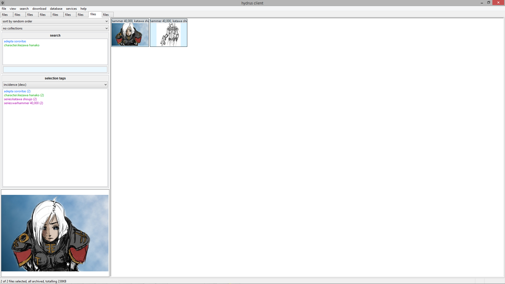
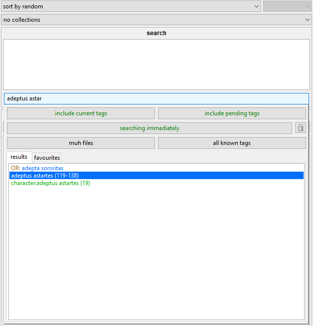
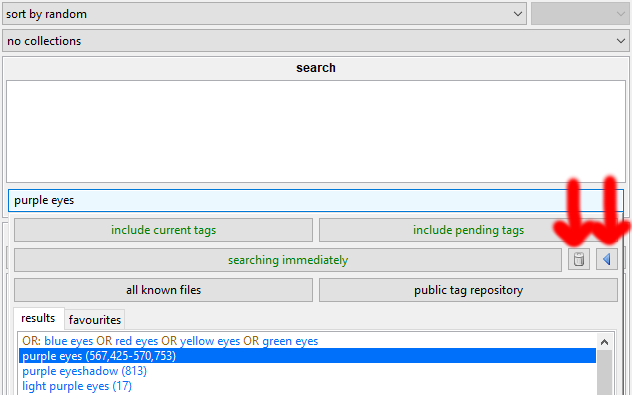
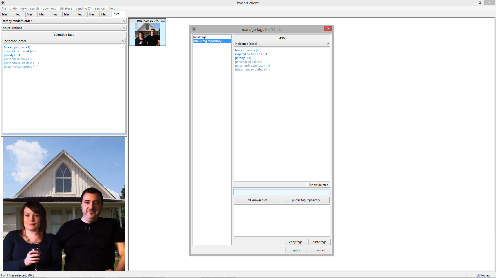

# getting started with tags

If any of this is confusing, a simpler guide is [here](https://github.com/Zweibach/text/blob/master/Hydrus/Hydrus%20Help%20Docs/00_tableOfContents.md), and some video guides are [here](https://github.com/CuddleBear92/Hydrus-guides)!

## how do we find files? { id="intro" }

So, you have stored some media in your database. Everything is hashed and cached. You can search by inbox and resolution and size and so on, but if you really want to find what we are looking for, you will have to use _tags_.

[FAQ: what is a tag?](faq.html#tags)

Your client starts with one local tags service, called 'my tags', which keeps all of its file->tag mappings in your client's database where only you can see them. It is a good place to practise. So, select a file and press F3:

The autocomplete dropdown in the manage tags dialog works very like the one in a normal search page--you type part of a tag, and matching results will appear below. You select the tag you want with the arrow keys and hit enter. Since your 'my tags' service doesn't have any tags in it yet, you won't get any results here except the exact match of what you typed. If you want to remove a tag, enter the exact same thing again or double-click it in the box above.

Prefixing a tag with a category and a colon will create a _namespaced_ tag. This helps inform the software and other users about what the tag is. Examples of namespaced tags are:

*   `character:batman`
*   `series:street fighter`
*   `person:jennifer lawrence`
*   `title:vitruvian man`

The client is set up to draw common namespaces in different colours, just like boorus do. You can change these colours in the options.

Once you are happy with your tags, hit 'apply' or just press enter on the text box if it is empty.

The tags are now saved to your database. Searching for any of them will return this file and anything else so tagged:

If you add more tags or system predicates to a search, you will limit the results to those files that match every single one:

You can also exclude a tag by prefixing it with a hyphen (e.g. `-heresy`).

## OR searching

Searches find files that match every search 'predicate' in the list (it is an **AND** search), which makes it difficult to search for files that include one **OR** another tag. More recently, simple OR search support was added. All you have to do is hold down Shift when you enter/double-click a tag in the autocomplete entry area. Instead of sending the tag up to the active search list up top, it will instead start an under-construction 'OR chain' in the tag results below:

You can keep searching for and entering new tags. Holding down Shift on new tags will extend the OR chain, and entering them as normal will 'cap' the chain and send it to the complete and active search predicates above.

Any file that has one or more of those OR sub-tags will match.

If you enter an OR tag incorrectly, you can either cancel or 'rewind' the under-construction search predicate with these new buttons that will appear:

You can also cancel an under-construction OR by hitting Esc on an empty input. You can add any sort of search term to an OR search predicate, including system predicates. Some unusual sub-predicates (typically a `-tag`, or a very broad system predicate) can run very slowly, but they will run much faster if you include non-OR search predicates in the search:

This search will return all files that have the tag `fanfic` and one or more of `medium:text`, a positive value for the like/dislike rating 'read later', or PDF mime.

## tag repositories

It can take a long time to tag even small numbers of files well, so I created _tag repositories_ so people can share the work.

Tag repos store many file->tag relationships. Anyone who has an access key to the repository can sync with it and hence download all these relationships. If any of their own files match up, they will get those tags. Access keys will also usually have permission to upload new tags and ask for incorrect ones to be deleted.

Anyone can run a tag repository, but it is a bit complicated for new users. I ran a public tag repository for a long time, and now this large central store is run by users. It has over a billion tags and is free to access and contribute to.

To connect with it, please check [here](access_keys.html). **Please read that page if you want to try out the PTR. It is only appropriate for someone on an SSD!**

If you add it, your client will download updates from the repository over time and, usually when it is idle or shutting down, 'process' them into its database until it is fully synchronised. The processing step is CPU and HDD heavy, and you can customise when it happens in _file->options->maintenance and processing_. As the repository synchronises, you should see some new tags appear, particularly on famous files that lots of people have.

You can watch more detailed synchronisation progress in the _services->review services_ window.

Your new service should now be listed on the left of the manage tags dialog. Adding tags to a repository works very similarly to the 'my tags' service except hitting 'apply' will not immediately confirm your changes--it will put them in a queue to be uploaded. These 'pending' tags will be counted with a plus '+' or minus '-' sign:

Notice that a 'pending' menu has appeared on the main window. This lets you start the upload when you are ready and happy with everything that you have queued.

When you upload your pending tags, they will commit and look to you like any other tag. The tag repository will anonymously bundle them into the next update, which everyone else will download in a day or so. They will see your tags just like you saw theirs.

If you attempt to remove a tag that has been uploaded, you may be prompted to give a reason, creating a petition that a janitor for the repository will review.

I recommend you not spam tags to the public tag repo until you get a rough feel for the [guidelines](https://github.com/CuddleBear92/Hydrus-Presets-and-Scripts/blob/master/tag%20guidelines), and my original [tag schema](tagging_schema.html) thoughts, or just lurk until you get the idea. It roughly follows what you will see on a typical booru. The general rule is to only add factual tags--no subjective opinion.

You can connect to more than one tag repository if you like. When you are in the _manage tags_ dialog, pressing the up or down arrow keys on an empty input switches between your services.

[FAQ: why can my friend not see what I just uploaded?](faq.html#delays)