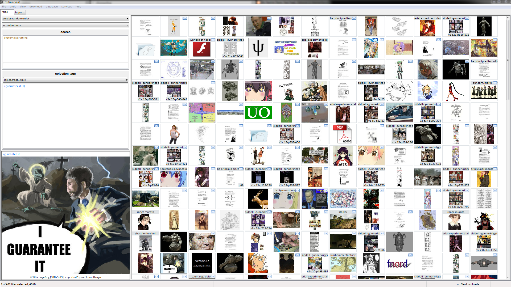

## on being anonymous

Nearly all sites use the same pseudonymous username/password system, and nearly all of them have the same drama, sockpuppets, and egotistical mods. Censorship is routine. That works for many people, but not for me.

I enjoy being anonymous online. When you aren't afraid of repercussions, you can be as truthful as you want. You can have conversations that can happen nowhere else. It's fun!

I've been on the imageboards for a long time, saving everything I like to my hard drive. After a while, the whole collection was just too large to manage on my own.

## the hydrus network

So! I'm developing a program that helps people organise their files together anonymously. I want to help you do what you want with your stuff, and that's it. You can share some tags and files with other people if you want to, but you don't have to connect to anything if you don't. **The default is complete privacy, no sharing**, and every upload requires a conscious action on your part. I don't plan to ever record metrics on users, nor serve ads, nor charge for my software. The software never phones home.

This does a lot more than a normal image viewer. If you are totally new to the idea of personal media collections and tagging, I suggest you start slow, walk through the getting started guides, and experiment doing different things. If you aren't sure on what a button does, try clicking it! You'll be importing thousands of files and applying _tens_ of thousands of tags in no time.

The client is chiefly a file database. It stores your files inside its own folders, managing them far better than an explorer window or some online gallery. Here's a screenshot of one of my test installs with a search showing all files:

[](images/example_client.png)

As well as the client, there is also a server that anyone can run to store files or tags for sharing between many users. The mechanics of running a server is usually confusing to new users, so wait a little while before you explore this. Some users run a public tag repository with hundreds of millions of tags that you can access and contribute to if you wish.

I have many plans to expand the client and the network.

## statement of principles

*   No speech should be outlawed.
*   Everyone should be able to control their own media diet.
*   Computer data and network logs should be absolutely private.

None of the above are currently true, but I would love to live in a world where they were. My software is an attempt to move us a little closer.

I try to side with the person over the authority, the distributed over the centralised. I still use gmail and youtube just like pretty much everyone, but I would rather be using different systems, especially in ten years. No one seemed to be making what I wanted for file management, so I decided to do it myself, and here we are.

If, after a few months, you find you enjoy the software and would like to further support it, I have set up a simple no-reward patreon, which you can read more about [here](support.html).

## license

These programs are free software. Everything I, hydrus dev, have made is under the Do What The Fuck You Want To Public License, Version 3, [as published](https://github.com/sirkris/WTFPL/blob/master/WTFPL.md) by Kris Craig.

``` title="license.txt"
--8<-- "license.txt"
```

Do what the fuck you want to with my software, and if shit breaks, DEAL WITH IT.

[Happy? Go on to the getting started guide ---->](getting_started_installing.html)